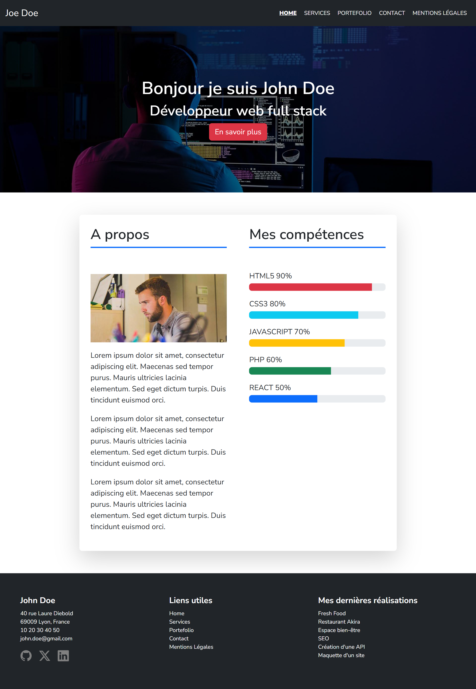
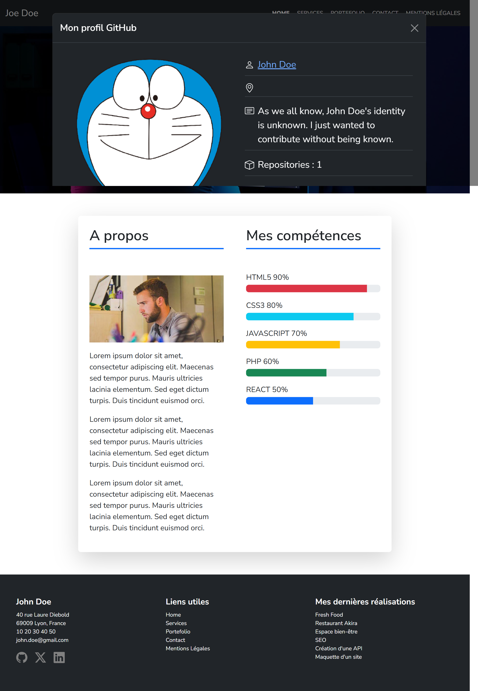
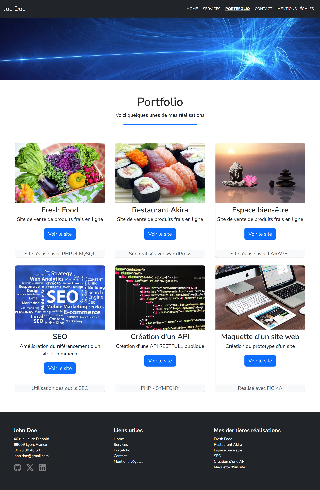

# 💼 Portfolio — John Doe

A multi-page portfolio website for **John Doe**, a fictional aspiring web developer, built with React and Bootstrap from mockups provided in the project brief.

> Fictional project built as part of the Web & Mobile Web Developer training (Centre Européen de Formation). John Doe is a fictional character: this is not my own portfolio.

---

## 📖 About the project

The goal was to build and launch the website of a junior web developer, faithfully reproducing the mockups provided. The site is a React single-page application styled mainly with Bootstrap, with a small amount of custom CSS for visual effects.

The project was developed with a Git workflow based on **feature branches and pull requests**: one branch per page or feature (home page, services, portfolio, contact, modal, SEO, W3C review...), merged through 10 pull requests.

<p align="center">
  
  
  
</p>

---

## ✨ Features

- **Home page**: hero section, presentation and skills with progress bars
- **GitHub profile modal**: avatar, bio, number of repositories and followers, fetched live from the **GitHub REST API**
- **Services page**: service cards (UX design, web development, SEO)
- **Portfolio page**: project cards with image, description and skills used
- **Contact page**: contact form and contact details
- **Legal notice page**: content organised in Bootstrap accordions
- **SEO**: meta description in `index.html`, `noindex` on the legal notice page with `react-helmet-async`, and a `robots.txt`
- **Responsive design** checked on mobile, tablet and desktop views
- **W3C validation** of the generated markup

---

## 🛠 Tech stack

| Layer | Technology | Why |
|---|---|---|
| Front-end | React (Create React App) | Component-based UI, reusable cards and sections |
| Routing | React Router | Client-side navigation between the 5 pages |
| Styling | Bootstrap 5 + custom CSS | Responsive grid, modal and accordion components |
| Data | GitHub REST API (`fetch`) | Live profile data in the modal |
| SEO | react-helmet-async | `noindex` meta tag on the legal notice page |
| Icons | react-icons | Lightweight icon components |

---

## 🗂 Project structure

```
portfolio-john-doe/
├── public/
│   ├── img/              # Hero, banner and portfolio images
│   ├── index.html
│   └── robots.txt
└── src/
    ├── components/       # Header, Footer, HeroHome, CardHome, Modale, Accordion,
    │                     # ServiceCard, ProjectCard, CardContact, PageIntro...
    ├── pages/            # Home, Services, Portfolio, Contact, LegalNotice
    ├── App.js            # Routes
    └── index.js
```

---

## 🚀 Getting started locally

### Prerequisites
- Node.js 18+
- npm

### Steps

```bash
git clone https://github.com/Marine-Briet/portfolio-john-doe.git
cd portfolio-john-doe
npm install
npm start
```

The app opens at http://localhost:3000.

### Production build

```bash
npm run build
```

Optimised files are generated in the `build/` folder.

---

## 🔭 Future improvements

- Connect the contact form to an email service (it is currently a static form)
- Deploy the site online (e.g. Netlify)
- Migrate from Create React App, which is no longer maintained, to Vite
- Make my own Porfolio 

---

## 👤 Author

Marine BRIET
Built as part of the Web & Mobile Web Developer training — Centre Européen de Formation.